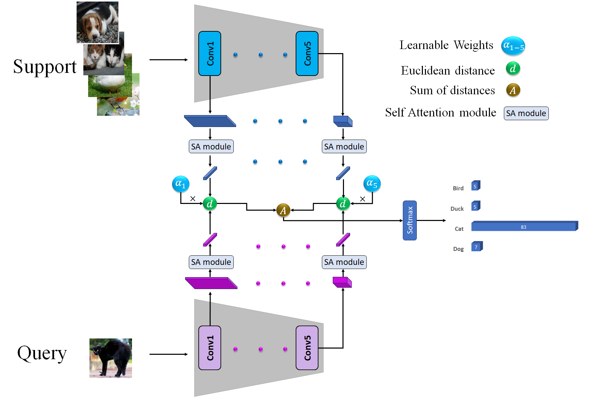
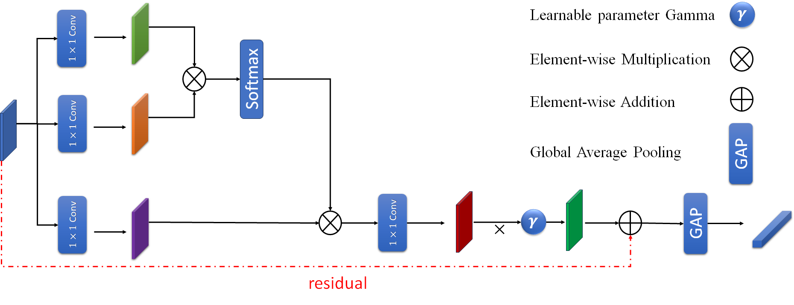

# Enhancing Few-Shot Image Classification through Learnable Multi-Scale Embedding and Attention Mechanisms
Implementation of a Few-Shot Image Classification Model based on the Prototypical Network Model and Tested on the MiniImagenet and FC100 Datasets.

For more information, check out our paper on [[arXiv](https://arxiv.org/abs/2409.07989)].

## Model

Our model consists of the following components:
1. We employed different feature spaces and extracted feature maps at five stages to capture both global and task-specific features.
2. We integrated learnable parameter weights at each stage.
3. We utilized a self-attention mechanism for each feature map obtained from every stage to capture more valuable information.

The final model architecture is as follows:



The mapper architecture is as follows:



You can study the model in more detail from this [PDF](finalreport.pdf).

## How to run
For the 5-way 5-shot:
```bash
python train.py --max-epoch 200 --save-epoch 20 --shot 5 --query 10 --train-way 30 --test-way 5 --save-path ./save/proto-5-change --gpu 0
```

For the 5-way 1-shot:
```bash
python train.py --max-epoch 200 --save-epoch 20 --shot 1 --query 10 --train-way 20 --test-way 5 --save-path ./save/proto-1-change --gpu 0
```
## Citation
If you use this repository in your work, please cite the following paper:
```bibtex
@article{askari2024enhancing,
  title={Enhancing Few-Shot Image Classification through Learnable Multi-Scale Embedding and Attention Mechanisms},
  author={Askari, Fatemeh and Fateh, Amirreza and Mohammadi, Mohammad Reza},
  journal={arXiv preprint arXiv:2409.07989},
  year={2024}
}
